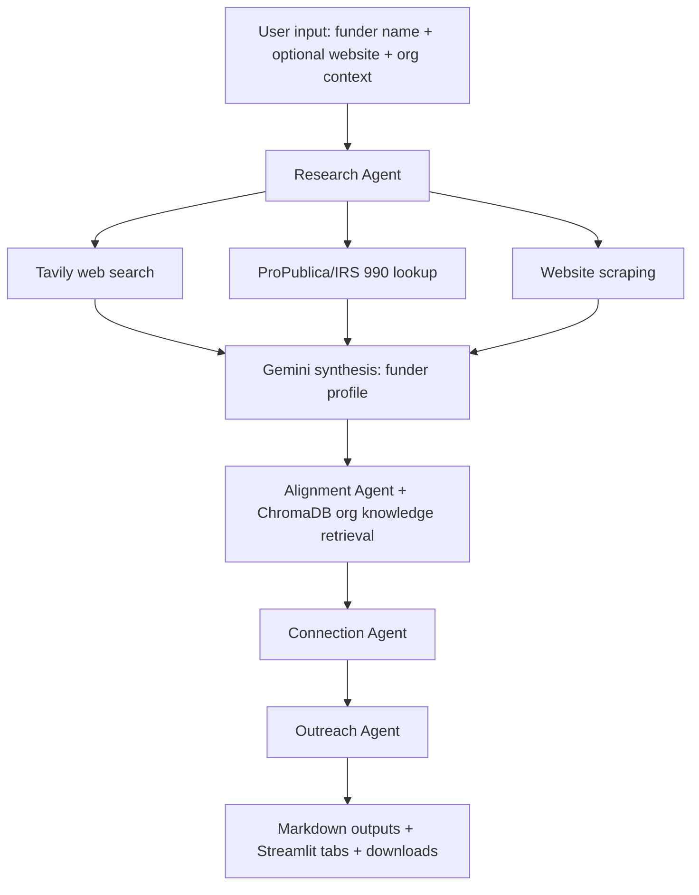

# Funder Intelligence Agent 🔍

*Research funders, map mission alignment, find warm paths, and draft outreach in one Streamlit app.*


## Demo / Screenshot 🖼️


> Replace the image path above with your actual screenshot/GIF.

## Overview 📌

Funder Intelligence Agent is a Streamlit-based AI workflow for grant prospecting and relationship
strategy. Given a target foundation, it collects public signals (web search, IRS 990 context, and
website data), synthesizes a funder profile, maps alignment with your organization, identifies warm
introduction paths, and generates editable outreach drafts.

The app is designed for non-technical operators while preserving a modular, agent-based Python code
structure for maintainers.

## Key Features ✅

- **Multi-stage intelligence pipeline**: Research → Alignment → Connections → Outreach drafts.
- **Mode-based execution**: Run full pipeline or only one stage (research/alignment/connections/
  outreach).
- **Organization-aware analysis**: Uses local org knowledge docs with ChromaDB semantic retrieval.
- **Warm-intro strategy support**: Surfaces relationship paths using board, leadership, and network
  signals.
- **Export-ready outputs**: Download each stage as Markdown or a combined report.
- **Deployment-ready UI**: Streamlit interface with cloud/local secret loading.

## How It Works ⚙️

The app orchestrates specialized agents from `app.py`:



### Pipeline Outputs

- `*_profile.md`: synthesized funder profile
- `*_alignment.md`: strategic alignment brief
- `*_connections.md`: ranked connection path analysis
- `*_outreach_drafts.md`: personalized email drafts
- Raw supporting files (`*_raw_data.txt`, `*_connections_raw.txt`) for traceability

## Tech Stack 🧰

- **Frontend / App UI**
  - Streamlit
- **LLMs**
  - Google Gemini (`google-genai`, model default: `gemini-2.0-flash`)
  - Groq (`groq`, model default: `llama-3.3-70b-versatile`)
- **Search & Data Acquisition**
  - Tavily Web Search (`tavily-python`)
  - HTTP + parsing (`requests`, `beautifulsoup4`)
  - IRS/990 enrichment via project tooling (`tools/irs900.py`)
- **Knowledge Retrieval / Storage**
  - ChromaDB (local vector store in `data/chromadb/`)
- **Utilities**
  - `python-dotenv`, `rich`, `plotly`
- **Deployment**
  - Streamlit Community Cloud

## Prerequisites 📋

- Python **3.11+** recommended
- `pip` and virtual environment tooling
- API keys/accounts:
  - Tavily API key
  - Google Gemini API key
  - Groq API key
- (Optional but recommended) Streamlit Community Cloud account for hosted deployment

## Installation 🚀

```bash
git clone https://github.com/<your-username>/funder-intel-agent.git
cd funder-intel-agent
python -m venv .venv
source .venv/bin/activate  # Windows: .venv\Scripts\activate
pip install --upgrade pip
pip install -r requirements.txt
```

Create a local `.env` file in the project root:

```bash
cat > .env <<'ENV'
GEMINI_API_KEY=your_gemini_key
GROQ_API_KEY=your_groq_key
TAVILY_API_KEY=your_tavily_key
ENV
```

Run the Streamlit app:

```bash
streamlit run app.py
```

## Environment Variables 🔐

| Variable | Required | Used For |
|---|---|---|
| `GEMINI_API_KEY` | Yes | Gemini calls for research synthesis, alignment analysis, and connection analysis |
| `GROQ_API_KEY` | Yes | Groq calls for outreach draft generation |
| `TAVILY_API_KEY` | Yes | Tavily web search queries for funder and network research |

> The app supports both local `.env` loading and Streamlit Cloud secrets via `st.secrets`.

## Usage 🧭

1. Start the app with `streamlit run app.py`.
2. In the sidebar:
   - Select a mode (`Full Pipeline`, `Research Only`, etc.).
   - Enter your organization name.
   - Add known current funders (one per line).
3. In the main panel:
   - Enter a **Funder Name** (required).
   - Optionally provide a **Website URL** (if omitted, the app attempts auto-detection).
4. Click **Run Agent**.
5. Review results in tabs and download per-stage files or a complete report.

### Inputs

- Required:
  - Funder name
- Optional:
  - Funder website URL
  - Organization name
  - Known funder list
  - Local org knowledge docs in `data/org_knowledge/` (`.md`/`.txt`)

### Outputs

- Structured Markdown intelligence artifacts under `data/output/`
- In-app rendered tabs for profile, alignment, connections, and outreach
- Downloadable complete report (`*_complete_report.md`)

## Project Structure 🗂️

```text
funder-intel-agent/
├── app.py                     # Streamlit UI and pipeline orchestration
├── main.py                    # CLI-style entrypoint (if used)
├── config.py                  # API key loading, model config, usage tracking
├── requirements.txt           # Python dependencies
├── packages.txt               # System packages for deployment (build-essential)
├── agents/
│   ├── reasercher.py          # Research agent (web + 990 + scrape + profile synthesis)
│   ├── mapper.py              # Alignment mapping agent
│   ├── connector.py           # Connection path analysis agent
│   └── drafters.py            # Outreach draft generation agent
├── tools/
│   ├── llm.py                 # LLM provider routing/wrappers
│   ├── web_search.py          # Tavily search helpers
│   ├── web_scraper.py         # Website scraping logic
│   ├── irs900.py              # IRS/990 research helpers
│   ├── connection_search.py   # Connection discovery tooling
│   ├── org_knowledge.py       # ChromaDB knowledge base build/retrieval
│   └── path.py                # Safe path/output helper utilities
├── prompts/                   # Prompt templates for each agent stage
├── data/
│   ├── org_knowledge/         # Your org docs consumed by retrieval
│   ├── output/                # Generated Markdown and raw artifacts
│   └── chromadb/              # Local ChromaDB persistence
└── README.md
```

## Deployment ☁️

### Streamlit Community Cloud

1. Push this repository to GitHub.
2. In Streamlit Community Cloud, create a new app and select:
   - **Repository**: your fork/repo
   - **Branch**: desired branch
   - **Main file path**: `app.py`
3. Add secrets in **App Settings → Secrets**:

```toml
GEMINI_API_KEY="your_gemini_key"
GROQ_API_KEY="your_groq_key"
TAVILY_API_KEY="your_tavily_key"
```

4. Deploy. Streamlit installs `requirements.txt` and system packages from `packages.txt`.

## Roadmap 🛣️

- Add source citation links in generated Markdown outputs.
- Add retry/backoff and clearer per-provider error surfacing in the UI.
- Support batch analysis for multiple funders in one run.
- Add human feedback loop to improve draft tone and alignment over time.
- Add test suite and CI checks for core agent/tool modules.

## Contributing 🤝

Contributions are welcome.

1. Fork the repo and create a feature branch.
2. Make focused, well-documented changes.
3. Run relevant local checks.
4. Open a pull request with context, screenshots (if UI changes), and test notes.

## License 📄

This project is licensed under the MIT License.

If you have not added a license file yet, add an `LICENSE` file with MIT terms before publishing.

## Acknowledgments 🙏

- [Streamlit](https://streamlit.io/)
- [Tavily](https://tavily.com/)
- [Google Gemini API](https://ai.google.dev/)
- [Groq](https://groq.com/)
- [ChromaDB](https://www.trychroma.com/)
- [Beautiful Soup](https://www.crummy.com/software/BeautifulSoup/)

## Contact 📬

- GitHub: `https://github.com/<your-username>`
- Email: `<your-email@example.com>`
